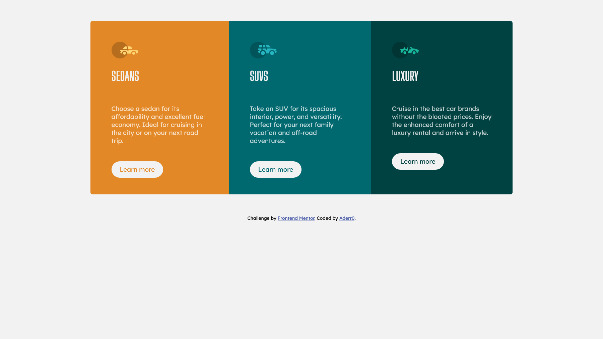
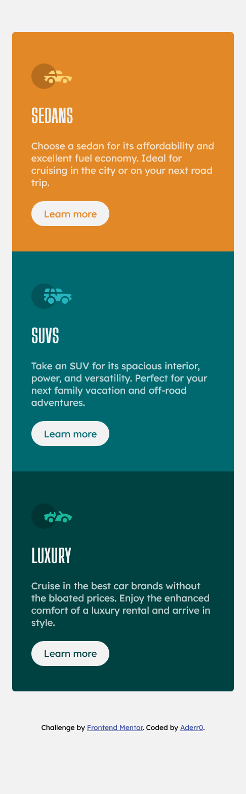

# Frontend Mentor - 3-column preview card component solution

This is a solution to the [3-column preview card component challenge on Frontend Mentor](https://www.frontendmentor.io/challenges/3column-preview-card-component-pH92eAR2-). Frontend Mentor challenges help you improve your coding skills by building realistic projects. 

## Table of contents

- [Overview](#overview)
  - [The challenge](#the-challenge)
  - [Screenshot](#screenshot)
  - [Links](#links)
- [My process](#my-process)
  - [Built with](#built-with)
  - [What I learned](#what-i-learned)
  - [Continued development](#continued-development)
- [Author](#author)

## Overview

### The challenge

Users should be able to:

- View the optimal layout depending on their device's screen size
- See hover states for interactive elements

### Screenshot

### Links

- Solution URL: [Github link](https://github.com/Aderr0/column-preview-card-component-main)
- Live Site URL: [Published with github](https://aderr0.github.io/column-preview-card-component-main/)

## My process

### Built with

- Semantic HTML5 markup
- CSS custom properties
- Flexbox

### What I learned

- put into practice flexbox
- improve my responsive skill
- understand more and more css (get the css mind)

### Continued development

Like my last submition, i'll continue to work with flexbox wich is really useful

## Author

- Website - [In development](https://thispersondoesnotexist.com/)
- Frontend Mentor - [@Aderr0](https://www.frontendmentor.io/profile/Aderr0)
